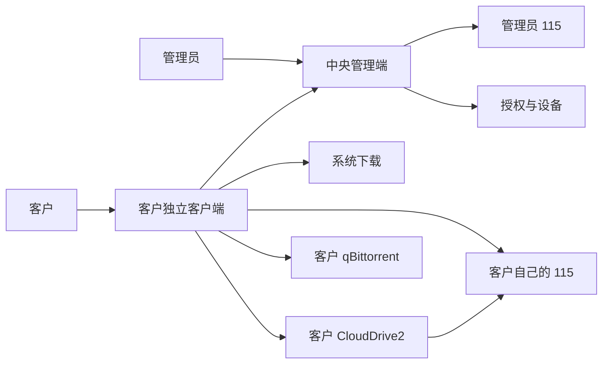
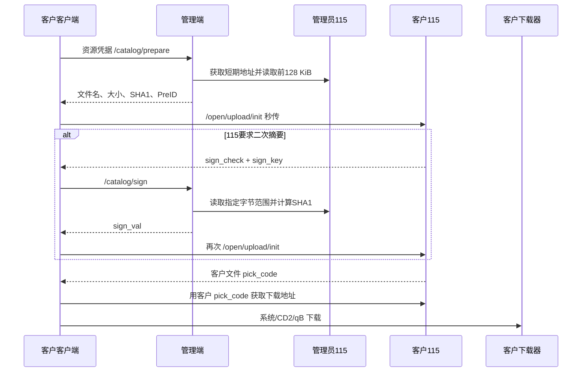

# BossTransfer 2.1.0 架构

## 管理端

管理端只有两类业务职责：

1. 资源：绑定管理员的 115 Open 账号，选择可搜索目录，为已授权设备提供搜索和秒传摘要。
2. 授权：创建客户、签发一次性授权码、设置有效期和设备数、撤销授权、释放设备。

管理端不保存客户下载器配置，也不决定客户使用哪种下载方式。

## 客户端

每位客户在自己的 NAS 上运行独立客户端。客户端保存：

- 本地 Web 登录账号；
- 激活后的设备身份；
- 客户自己的 115 Open 令牌与秒传目录；
- 本地保存目录；
- 可选的 CloudDrive2 或 qBittorrent 配置。

## 搜索流程

1. 客户端携带设备凭据请求管理端 `/api/v1/catalog/search`。
2. 管理端验证授权状态、设备状态和租约。
3. 管理端通过 115 Open API 搜索管理员选定的目录。
4. 每条结果被封装为 AES-GCM 加密的短期资源凭据，并绑定当前设备。
5. 客户端按真实影视文件夹聚合结果，只把视频和种子文件放进下载列表。

响应不包含管理员的 115 提取码、访问令牌或下载地址。

## 秒传与下载流程

只有 `upload/init` 返回秒传成功状态后，客户端才会请求客户文件的下载地址。未命中时流程停止，不会退回管理员 115 直链。

## 三种下载方式

### 系统下载

客户端使用客户 115 返回的短期地址，写入所选 NAS 目录。下载先写 `.part` 临时文件，大小校验和同步成功后原子改名。

### CloudDrive2

客户在自己的 115 中选择秒传目录，同时在自己的 CD2 中选择对应的云端目录。秒传完成后，客户端通过 CD2 的 `GetDownloadLink` 读取真实文件，再保存到本地目录。

这个流程不会调用 CD2 离线下载，也不会创建 `[Search]` 虚拟目录。

### qBittorrent

qBittorrent 只适用于磁力或 `.torrent`。普通 MKV、MP4 等文件不会显示为可用方式。

## 凭据边界

| 数据 | 保存位置 | 浏览器可见内容 |
|---|---|---|
| 管理员 115 令牌 | 管理端数据卷，AES-GCM | 绑定状态、用户名称、所选目录 |
| 客户授权码 | 管理端只保存摘要 | 完整码只在签发时显示一次 |
| 客户设备令牌和私钥 | 客户端数据卷，AES-GCM | 激活状态 |
| 客户 115 令牌 | 客户端数据卷，AES-GCM | 绑定状态、用户名称、所选目录 |
| CD2 密码或令牌 | 客户端数据卷，AES-GCM | 是否已保存 |
| qB 密码或 API Key | 客户端数据卷，AES-GCM | 是否已保存 |

## 网络关系

- 客户端主动访问中央管理端。
- 管理端和客户端分别访问 115 Open API。
- 客户端访问客户 NAS 上的 CD2 或 qB。
- 管理端不主动连接客户 NAS。
- 分离部署时建议给管理端配置 HTTPS 域名。
