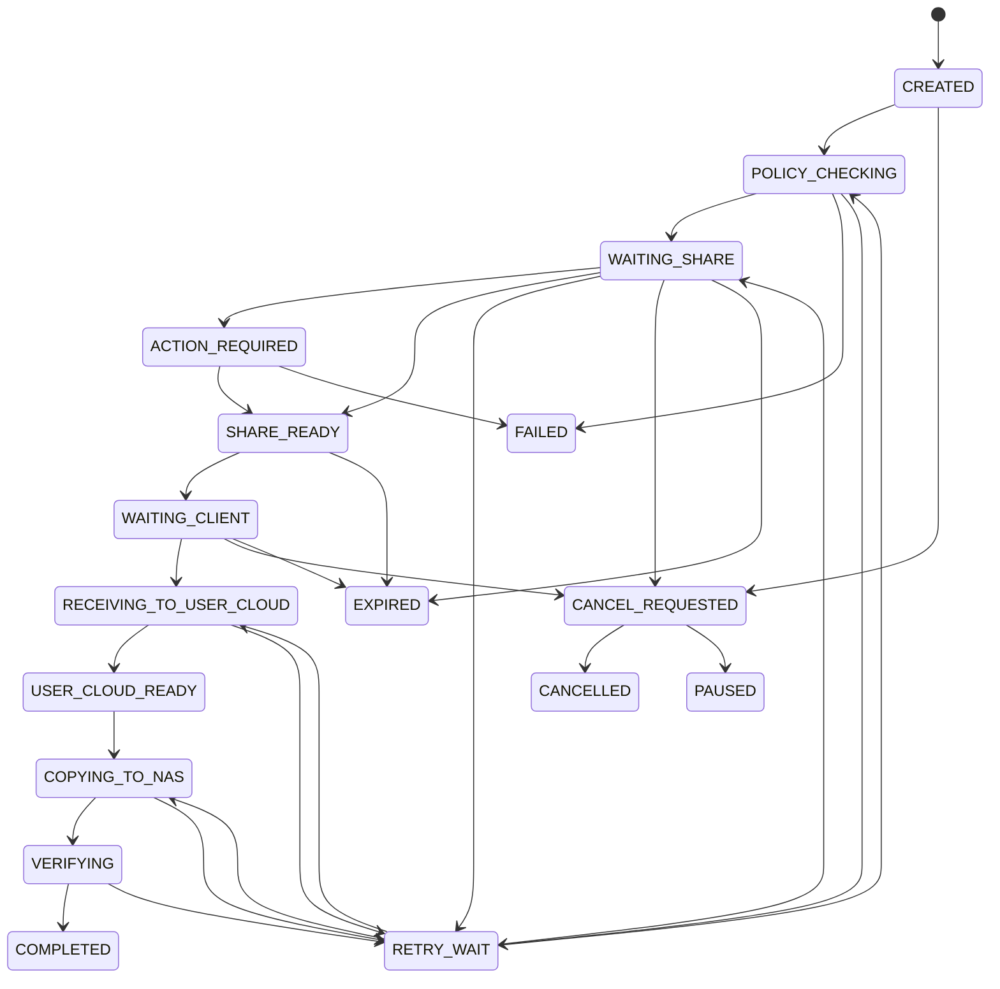

# 任务状态机

> 历史设计草案：下列完整分布式状态机未作为 2.0.0 接口发布。2.0.0 当前任务状态为 `queued`、`running`、`submitted`、`completed`、`failed` 和 `cancelled`，以 [客户操作教程](customer-operation-guide.md) 为准。

## 主状态

```text
CREATED
POLICY_CHECKING
WAITING_SHARE
ACTION_REQUIRED
SHARE_READY
WAITING_CLIENT
RECEIVING_TO_USER_CLOUD
USER_CLOUD_READY
COPYING_TO_NAS
VERIFYING
COMPLETED
RETRY_WAIT
PAUSED
CANCEL_REQUESTED
CANCELLED
FAILED
EXPIRED
```

## 状态图



## 迁移规则

- 每次迁移记录 UTC 时间、执行者、原因、外部任务 ID、事件 ID 和 `trace_id`。
- 外部调用前后都落库。
- 写接口必须携带 `Idempotency-Key`。
- 同一用户、设备、内容和目标目录的重复点击返回现有活动任务。
- CD2 不支持幂等键时保存其任务 ID，并在重试前对账。
- 配额只在首次创建任务时计算一次，重试不得重复扣减。
- 取消必须根据实际阶段处理，不能取消时展示真实原因。

## 错误分类

| 分类 | 示例 | 处理 |
|---|---|---|
| 可重试 | 网络超时、429、临时 5xx、CD2 暂时离线 | 上限指数退避，尊重 `Retry-After` |
| 用户处理 | CD2 Token 失效、115 掉线、磁盘不足、目录无权限 | 进入 `ACTION_REQUIRED` 或 `PAUSED` |
| 永久失败 | 来源删除、用户无权、授权吊销、文件不匹配 | 进入 `FAILED` |

## 幂等键

创建任务的幂等键由客户端生成，服务端以如下范围唯一约束：

```text
user_id + device_id + catalog_item_id + target_profile_id + idempotency_key
```

活动任务去重另有业务唯一约束：

```text
user_id + device_id + catalog_item_id + target_cloud_dir + target_nas_dir + non_terminal
```
